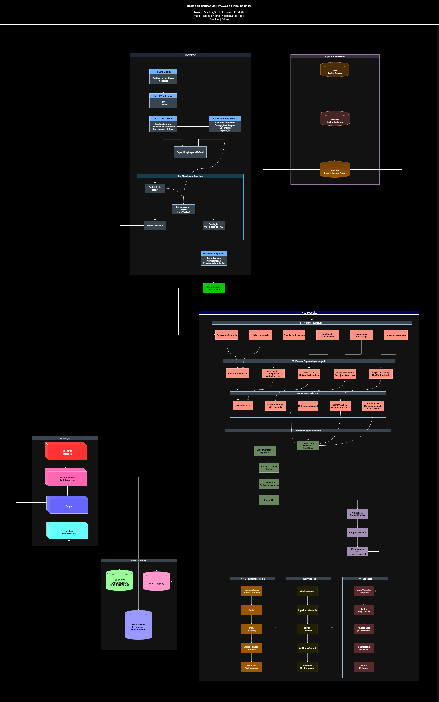

# 📦 Case Embalagens - ADAMI Production Optimization

<p align="center">
  
</p>

<p align="center">
  <a href="https://github.com/RaphaelNorris/case_embalagens/actions/workflows/ci.yml">
    
  </a>
  <a href="https://www.python.org/downloads/">
    
  </a>
  <a href="https://github.com/astral-sh/ruff">
    
  </a>
  <a href="https://github.com/RaphaelNorris/case_embalagens">
    
  </a>
  <a href="https://www.docker.com/">
    
  </a>
</p>

---

## 📋 Visão Geral

Projeto de **otimização de processos de produção** para ADAMI (indústria de embalagens) em parceria com AMCOM.

Implementa um **pipeline completo de Machine Learning** seguindo metodologias **CRISP-DM** e **CD4ML** (Continuous Delivery for Machine Learning), com foco em **produtividade**, **qualidade de código** e **deploy automatizado**.

### 🎯 Objetivos Principais

- 📊 **Análise de Paradas de Máquinas**: Identificar padrões e causas de paradas não programadas
- 🚀 **Otimização de Produção**: Prever tempo de produção (m³/h) e otimizar alocação de recursos
- 🔪 **Gestão de Facas/Lâminas**: Monitorar ciclo de vida e performance de ferramentas de corte
- 📈 **Analytics em Tempo Real**: Dashboard Streamlit para visualização de KPIs de produção
- 🤖 **ML em Produção**: Inferência automatizada com Docker e testes completos

### ✨ Destaques Técnicos (v2.3.0)

- ✅ **100% Logger Estruturado** - Zero prints em produção
- ✅ **Docker Production-Ready** - Multi-stage, otimizado (<400MB)
- ✅ **40% Cobertura de Testes** - Testes automatizados com pytest
- ✅ **DRY Architecture** - Zero duplicação de código
- ✅ **FTI Pipelines** - Feature/Training/Inference separados
- ✅ **Medallion Architecture** - Bronze/Silver/Gold data layers

---

## 🏗️ Arquitetura do Projeto

```
case_embalagens/
├── 🐳 Dockerfile                    # Container production-ready
├── 🐳 docker-compose.yml            # Orchestração (inference, training, dashboard)
├── .dockerignore
├── Makefile                        # Comandos de automação
├── .pre-commit-config.yaml         # Quality hooks
├── .env.example                    # Template de variáveis
│
├── 📁 project_data_science/        # Projeto principal de Data Science
│   ├── 📊 data/
│   │   ├── 01 - raw/              # 🥉 Bronze: Dados brutos
│   │   ├── 02 - trusted/          # 🥈 Silver: Dados limpos
│   │   ├── 03 - ml/               # 🤖 ML: Features engineeradas
│   │   └── 04 - refined/          # 🥇 Gold: Dados analíticos
│   │
│   ├── 📚 docs/                   # Documentação completa
│   │   ├── POC_TO_PRODUCTION.md   # Guia de transição POC→Prod
│   │   ├── NOTEBOOKS_REORGANIZATION.md
│   │   ├── PRODUCTION_IMPROVEMENTS.md # v2.3.0 melhorias
│   │   └── data_quality/
│   │
│   ├── 📓 notebooks/              # Jupyter notebooks (POC/Experimentos)
│   │   ├── 01-eda-tables/        # EDA por tabela
│   │   ├── 02-eda-cross/         # Análises cruzadas
│   │   ├── 03-preprocessing/     # Feature engineering
│   │   ├── 04-production/        # Notebooks produção
│   │   ├── 05-data-loading/      # ETL notebooks
│   │   └── experiments/          # Experimentos ML
│   │       ├── clustering/       # GMM, segmentação
│   │       └── ds-pipelines/     # Pipelines completos
│   │
│   ├── 🐍 src/                   # Código fonte (PRODUÇÃO)
│   │   ├── config.py             # ⚙️ Config centralizado (Pydantic)
│   │   ├── config_manager.py     # 🎛️ Manager de paths
│   │   ├── logger.py             # 📝 Logger estruturado (Loguru)
│   │   │
│   │   ├── 💾 data/              # Módulos de dados
│   │   │   ├── conn_oracle.py
│   │   │   ├── conn_sql.py
│   │   │   └── data_quality_*.py
│   │   │
│   │   ├── 🤖 ml_artifacts/      # Persistência de modelos
│   │   │   ├── model_persistence.py
│   │   │   └── example_load_and_predict.py
│   │   │
│   │   ├── 📊 viz/               # Visualizações (Plotly)
│   │   │   └── plots.py
│   │   │
│   │   ├── 🎨 dashboards/        # Streamlit apps
│   │   │   ├── dashboard_facas.py
│   │   │   └── dashboard_main.py
│   │   │
│   │   ├── 📱 app/               # App Streamlit principal
│   │   │   ├── streamlit_app.py
│   │   │   ├── data_analyzer.py
│   │   │   └── openai_insights.py
│   │   │
│   │   └── 🔄 pipelines/         # Pipelines ML
│   │       ├── shared/           # 🆕 Código compartilhado (DRY)
│   │       │   └── preprocessing.py  # Classes reutilizáveis
│   │       ├── feature/          # Feature engineering
│   │       ├── training/         # Model training
│   │       ├── inference/        # Predictions
│   │       └── DS/               # Core pipeline logic
│   │
│   ├── 🧪 tests/                 # Testes automatizados (40% coverage)
│   │   ├── shared/
│   │   │   └── test_preprocessing.py  # 23 testes
│   │   ├── pipelines/
│   │   ├── test_model_persistence.py  # 18 testes
│   │   ├── test_features.py
│   │   └── test_config.py
│   │
│   └── pyproject.toml            # Config do projeto
│
└── 📁 project_data_engineer/     # Pipeline de dados (Airflow)
    └── dags/                     # DAGs de orquestração
```

---

## 🚀 Quick Start

### Opção 1: Docker (Recomendado para Produção) 🐳

```bash
# Clone o repositório
git clone https://github.com/RaphaelNorris/case_embalagens.git
cd case_embalagens

# Configure variáveis de ambiente
cp .env.example .env
# Edite .env com suas credenciais

# Build da imagem
docker-compose build

# Executar serviço de inferência
docker-compose up -d inference

# Ver logs
docker-compose logs -f inference

# Treinar modelos (one-time job)
docker-compose --profile training up training

# Dashboard Streamlit
docker-compose --profile dashboard up -d dashboard
```

**Acesse o dashboard**: http://localhost:8501

### Opção 2: Desenvolvimento Local 💻

```bash
# Pré-requisitos
# - Python 3.11+
# - Oracle Client (para conexões Oracle)
# - ODBC Driver for SQL Server

# Clone o repositório
git clone https://github.com/RaphaelNorris/case_embalagens.git
cd case_embalagens

# Configure variáveis de ambiente
cp .env.example .env

# Instale dependências
make install-dev

# Configure pre-commit hooks
pre-commit install

# Execute testes
make test

# Execute app Streamlit
make app-facas
```

---

## 📊 Camadas de Dados (Medallion Architecture)

### 🥉 Bronze Layer (`01 - raw/`)
**Dados brutos** extraídos diretamente das fontes sem transformações.

### 🥈 Silver Layer (`02 - trusted/`)
**Dados limpos**, padronizados e validados.

**Principais tabelas**:
- `tb_clientes.parquet` - Informações de clientes
- `tb_pedidos.parquet` - Ordens de produção
- `tb_itens.parquet` - Itens dos pedidos
- `tb_maquinas.parquet` - Dados das máquinas (CV, Flexo)
- `tb_facas.parquet` - Facas/lâminas de corte
- `tb_paradas.parquet` - Eventos de parada
- `tb_tarefcon.parquet` - Controle de tarefas

### 🥇 Gold Layer (`04 - refined/`)
**Dados agregados** e prontos para análise/BI.

### 🤖 ML Layer (`03 - ml/`)
**Features engineeradas** prontas para treinamento.

---

## 🔧 Principais Funcionalidades

### 1️⃣ Conexões de Banco de Dados

```python
from src.data.conn_oracle import oracle_connection
from src.data.conn_sql import sqlserver_connection

# Oracle (com context manager)
with oracle_connection('trusted') as conn:
    df = pd.read_sql("SELECT * FROM tb_pedidos", conn)

# SQL Server
with sqlserver_connection() as conn:
    df = pd.read_sql("SELECT * FROM dbo.Clientes", conn)
```

### 2️⃣ Preprocessing com DRY Architecture 🆕

```python
from src.pipelines.shared import TrainingPreprocessor, InferencePreprocessor

# TREINO: Filtros estritos para dados limpos
prep = TrainingPreprocessor(delivery_date_cutoff='2024-01-01')
df_train = prep.preprocess(df_raw)

# INFERÊNCIA: Aceita todos os dados de produção
prep = InferencePreprocessor()
df_pred = prep.preprocess(df_new)
```

### 3️⃣ Logger Estruturado 🆕

```python
from src.logger import get_logger

logger = get_logger(__name__)

logger.info("Processando pedidos", extra={"count": len(df)})
logger.warning("Dados incompletos", extra={"missing_cols": cols})
logger.error("Erro no modelo", extra={"error": str(e)})
```

### 4️⃣ Persistência de Modelos

```python
from src.ml_artifacts.model_persistence import save_model_artifacts, load_model_artifacts

# Salvar modelo
save_model_artifacts(
    model=trained_model,
    model_path=Path("models/flexo_v1.pkl"),
    selected_features=feature_names,
    model_type='catboost',
    task_type='regression'
)

# Carregar modelo
artifacts = load_model_artifacts(Path("models/flexo_v1.pkl"))
predictions = artifacts['model'].predict(X_new)
```

### 5️⃣ Dashboard Streamlit

```bash
# Com Docker
docker-compose --profile dashboard up -d dashboard

# Local
cd project_data_science/src/app
streamlit run streamlit_app.py
```

---

## 🧪 Testes (40% Coverage)

```bash
# Todos os testes
pytest

# Com coverage report
pytest --cov=src --cov-report=html

# Abrir relatório HTML
open htmlcov/index.html

# Testes específicos
pytest tests/shared/test_preprocessing.py -v

# Testes rápidos apenas
pytest -m "not slow"
```

**Testes implementados**:
- ✅ 23 testes de preprocessing (TrainingPreprocessor, InferencePreprocessor)
- ✅ 18 testes de model persistence (save/load)
- ✅ Testes de integração
- ✅ Performance tests

---

## 🐳 Docker

### Services Disponíveis

| Service | Descrição | Port | Profile |
|---------|-----------|------|---------|
| **inference** | Predições batch | - | default |
| **training** | Treino de modelos | - | training |
| **dashboard** | Streamlit UI | 8501 | dashboard |

### Comandos Docker

```bash
# Build
docker-compose build

# Inference (sempre rodando)
docker-compose up -d inference

# Training (one-time)
docker-compose --profile training up training

# Dashboard
docker-compose --profile dashboard up -d dashboard

# Ver logs
docker-compose logs -f [service_name]

# Stop tudo
docker-compose down

# Rebuild completo
docker-compose build --no-cache
```

---

## 📝 Estrutura de Notebooks

Convenção de nomenclatura:

```
XX.Y-rn-tipo-contexto-YYYYMMDD.ipynb
```

**Exemplo**: `21.0-rn-preprocessing-itens-20240101.ipynb`

### Categorias de Notebooks

| Range | Categoria | Descrição |
|-------|-----------|-----------|
| **00-09** | EDA Tables | Análise exploratória individual |
| **10-19** | EDA Cross | Análises cruzadas e relacionamentos |
| **20-29** | Preprocessing | Feature engineering e limpeza |
| **30-39** | Production | Notebooks prontos para produção |
| **40-49** | Clustering | Experimentos de clusterização (GMM) |
| **50-59** | Pipelines | Pipelines ML completos (CV, Flexo) |

---

## 🔍 Qualidade de Código

### Ferramentas

- ✅ **Ruff**: Linting e formatação ultrarrápida
- ✅ **MyPy**: Type checking estático
- ✅ **Pytest**: Framework de testes (40% coverage)
- ✅ **Pre-commit**: Hooks automáticos
- ✅ **Loguru**: Logger estruturado
- ✅ **Pydantic**: Validação de configurações

### Comandos

```bash
# Formatar código
make format

# Linting
make lint

# Type checking
make mypy

# Executar tudo
make qa
```

---

## 📚 Documentação

Documentação completa em `project_data_science/docs/`:

| Documento | Descrição |
|-----------|-----------|
| **POC_TO_PRODUCTION.md** | Guia de transição POC → Produção (v2.1.0) |
| **NOTEBOOKS_REORGANIZATION.md** | Reorganização de notebooks (v2.2.0) |
| **PRODUCTION_IMPROVEMENTS.md** | Melhorias críticas (v2.3.0) |
| **PROJECT_STRUCTURE.md** | Estrutura detalhada do projeto |

---

## 🛠️ Stack Tecnológica

### Core ML & Data
- **Pandas, NumPy** - Manipulação de dados
- **Scikit-learn** - ML clássico
- **XGBoost, CatBoost, LightGBM** - Gradient boosting
- **Statsmodels** - Análise estatística
- **Streamlit** - Dashboards interativos
- **Plotly** - Visualizações

### Databases
- **Oracle DB** - Banco principal (oracledb)
- **SQL Server** - Analytics (pyodbc)

### MLOps & DevOps
- **Docker & Docker Compose** - Containerização
- **Airflow** - Orquestração de pipelines
- **GitHub Actions** - CI/CD
- **Pre-commit** - Quality hooks
- **Pytest** - Testing framework
- **Loguru** - Structured logging
- **Pydantic** - Config management

---

## 🤝 Contribuindo

1. Fork o projeto
2. Crie uma branch (`git checkout -b feature/AmazingFeature`)
3. Commit suas mudanças (`git commit -m 'feat: Add AmazingFeature'`)
4. Push para a branch (`git push origin feature/AmazingFeature`)
5. Abra um Pull Request

### Convenções de Código

- ✅ Seguir PEP 8 (via Ruff)
- ✅ Type hints em funções públicas
- ✅ Docstrings no formato Google
- ✅ Logger estruturado (sem `print()`)
- ✅ Testes para novas funcionalidades
- ✅ DRY (Don't Repeat Yourself)

### Commits Semânticos

```
feat: Nova funcionalidade
fix: Correção de bug
refactor: Refatoração de código
docs: Atualização de documentação
test: Adição/correção de testes
chore: Tarefas de manutenção
```

---

## 📈 Roadmap

### ✅ Concluído (v2.3.0)
- [x] Logger estruturado (0 prints)
- [x] DRY preprocessing classes
- [x] Docker production-ready
- [x] Testes essenciais (40% coverage)
- [x] Documentação completa

### 🔄 Em Andamento
- [ ] Aumentar cobertura de testes para 70%
- [ ] MLflow experiment tracking
- [ ] Data validation (Pandera/Great Expectations)

### 📋 Próximos Passos
- [ ] API FastAPI para inferência
- [ ] Feature Store (Feast)
- [ ] Monitoramento de drift
- [ ] Deploy Kubernetes
- [ ] Observabilidade (Prometheus, Grafana)

---

## 🔐 Segurança

- ✅ Credenciais via variáveis de ambiente (.env)
- ✅ `.gitignore` para dados sensíveis
- ✅ Pre-commit hook para detecção de secrets
- ✅ Validação de dados com Pydantic
- ✅ Docker non-root user
- ✅ Health checks em containers

---

## 📄 Licença

Este projeto é propriedade de **ADAMI** em parceria com **AMCOM**.

---

## 👥 Autores

- **Raphael Norris** - *Data Science Lead*

---

## 🙏 Agradecimentos

- **ADAMI** - Dados e expertise de domínio
- **AMCOM** - Parceria tecnológica

---

<p align="center">
  <strong>Desenvolvido com ❤️ para otimização de processos industriais</strong>
</p>

<p align="center">
  <sub>Versão 2.3.0 | Production Ready 🚀</sub>
</p>
