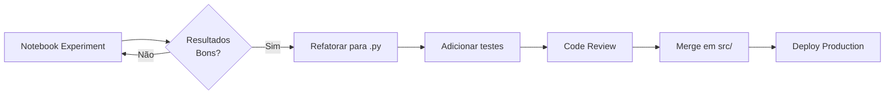

# Experiments

Notebooks **experimentais e exploratórios** de Machine Learning e análise avançada.

## 📁 Estrutura

```
experiments/
├── clustering/          # Experimentos de clusterização (GMM)
│   ├── 40.0 - CV GMM
│   ├── 41.0 - Flexo GMM
│   └── Visualizações (PNG)
│
└── ds-pipelines/        # Pipelines completos de ML
    ├── CV pipelines
    ├── Flexo pipelines
    └── Regressors
```

## 🎯 Propósito

Este diretório contém **experimentos de pesquisa** e **validação de conceitos**:

- 🧪 **Testar hipóteses** de modelagem
- 🔬 **Explorar algoritmos** diferentes
- 📊 **Validar features** novas
- 🎨 **Criar visualizações** exploratórias
- 📈 **Comparar abordagens** (CV vs Flexo, diferentes modelos)

## 🔀 Diferença: Experiments vs Production

| Aspecto | Experiments | Production (`src/`) |
|---------|-------------|---------------------|
| **Formato** | Notebooks (.ipynb) | Scripts Python (.py) |
| **Objetivo** | Exploração, validação | Código estável, reproduzível |
| **Qualidade** | Pode ter código "sujo" | Código limpo, testado |
| **Versionamento** | Múltiplas versões OK | Versão única, versionada |
| **Execução** | Manual, interativa | Automatizada (Airflow, etc) |
| **Documentação** | Markdown inline | Docstrings + READMEs |

## 📂 Subdiretórios

### 1. [`clustering/`](./clustering/)
Experimentos de **clusterização não-supervisionada**:
- Gaussian Mixture Models (GMM)
- Segmentação de perfis de produção
- Visualizações de clusters

### 2. [`ds-pipelines/`](./ds-pipelines/)
**Pipelines completos end-to-end** de ML:
- Feature engineering
- Model training
- Hyperparameter tuning
- Evaluation
- Persistence

## 🔄 Workflow Experimental → Production



### Passo a passo:

1. **Experimentar aqui** (notebooks)
   - Testar ideias rapidamente
   - Iterar features/modelos
   - Documentar descobertas

2. **Validar resultados**
   - Métricas aceitáveis?
   - Generalize bem?
   - É interpretável?

3. **Refatorar para Python**
   - Limpar código
   - Modularizar funções
   - Adicionar type hints

4. **Mover para `src/`**
   - `src/pipelines/feature/`
   - `src/pipelines/training/`
   - `src/pipelines/inference/`

5. **Adicionar testes**
   - Unit tests
   - Integration tests
   - Validação de outputs

6. **Versionamento**
   - Git commit
   - Versão do modelo (MLflow)
   - Documentar mudanças

## 📝 Convenções

### Nomenclatura de notebooks:
```
XX.Y-rn-tipo-contexto-YYYYMMDD.ipynb

Onde:
- XX.Y = Número sequencial
- rn = Iniciais do autor
- tipo = clustering, pipeline, analysis, etc.
- contexto = cv, flexo, ops, etc.
- YYYYMMDD = Data de criação
```

### Organização de código:
```python
# 1. Imports
import pandas as pd
from src.config_manager import get_config_manager

# 2. Config
cm = get_config_manager()
RANDOM_STATE = 42

# 3. Functions (se aplicável)
def custom_feature_engineering(df):
    ...

# 4. Análise/Experimento
# Células markdown explicativas
# Código executável
# Visualizações

# 5. Resultados e Conclusões
# Métricas finais
# Insights
# Próximos passos
```

## 🎨 Boas Práticas

### ✅ FAZER:
- Documentar hipóteses e resultados
- Versionar experimentos (v1, v2, v3)
- Usar `random_state` para reprodutibilidade
- Salvar visualizações importantes
- Comentar insights e descobertas
- Usar `config_manager` para paths

### ❌ EVITAR:
- Hardcoded paths absolutos
- Código sem explicação
- Notebooks gigantes (>1000 linhas)
- Sobrescrever experimentos anteriores
- Dados sensíveis no notebook
- Outputs muito grandes versionados

## 📊 Outputs Típicos

### Métricas
- CSV com resultados de experimentos
- Comparação de modelos

### Visualizações
- PNG/SVG de gráficos importantes
- SHAP plots
- Feature importance

### Modelos
- **NÃO** versionar modelos aqui
- Usar `src/ml_artifacts/` para modelos finais

## 🔗 Links Úteis

- **Dados preprocessados**: `../03-preprocessing/`
- **Código de produção**: `../../src/pipelines/`
- **Documentação**: `../../docs/`

---

**Status**: 🧪 Área de experimentação ativa

**Nota**: Experimentos são iterativos e evolutivos. Nem todos os notebooks aqui vão para produção - e tudo bem!
